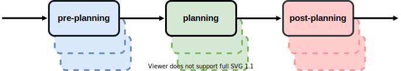

# GlobalPlannerPipeline

The GlobalPlannerPipeline (gpp) is a [pluginlib](http://wiki.ros.org/pluginlib) based "pipeline" for global planning within the [ros-navigation](https://github.com/ros-planning/navigation)-stack.

## Core Features

The library allows you to
- pre-process the inputs for your global planners,
- chain multiple global planners together,
- post-process the output form the global planners.

The goal is to separate auxiliary functions from the implementation of the global planners.
Additionally the library allows you to create a "planner-chain" - a feature successfully used in the [moveit](https://moveit.ros.org/) framework.

The project consists of two components.
The [gpp_interface](gpp_interface) defines two additional plugin-types: PrePlanning and PostPlanning plugins.
The [gpp_plugin](gpp_plugin) implements the pipeline which will load and run these pre- and post-planning plugins together with global-planner plugins.

## Concept
Before going into the details how to use and configure this library, we will first define some terminology.

Since the naming may be already confusing (plugins, plugins, plugins), we will refer to the plugins loaded by the GppPlugin as its *child-plugins*.   
Those child-plugins are *grouped* together accordingly to their interfaces.
The pre-planning group contains child-plugins implementing the [gpp_interface::PrePlanningInterface](gpp_interface/src/gpp_interface/pre_planning_interface.hpp);
The post-planning group contains child-plugins implementing the [gpp_interface::PostPlanningInterface](gpp_interface/src/gpp_interface/post_planning_interface.hpp);
The planning group accepts child-plugins implementing  either the [nav_core::BaseGlobalPlanner](http://wiki.ros.org/nav_core?distro=noetic#BaseGlobalPlanner_C.2B-.2B-_API) or [mbf_costmap_core::CostmapPlanner](https://github.com/magazino/move_base_flex/blob/master/mbf_costmap_core/include/mbf_costmap_core/costmap_planner.h) interfaces.



The pipeline concept is illustrated above.
When calling `GppPlugin::makePlan`, the GppPlugin will invoke its child-plugins.
The execution of those child-plugins is sequentially, going from the pre- over the planning- to the post-planning group.
The result from each child-plugin is passed on the the next.

Read on what you can do with the two [additional interfaces](gpp_interface/README.md), or how to configure the [GppPlugin](gpp_plugin/README.md).
Additionally have a look at the two example-plugins: [GppUpdateMap](examples/gpp_update_map) and [GppPrunePath](examples/gpp_prune_path).

## Build

The build-step is very similar to the standard ros-packages:
```
cd ~catkin_ws/src
git clone https://github.com/dorezyuk/gpp.git
catkin build gpp_plugin
```

## CI-Status

